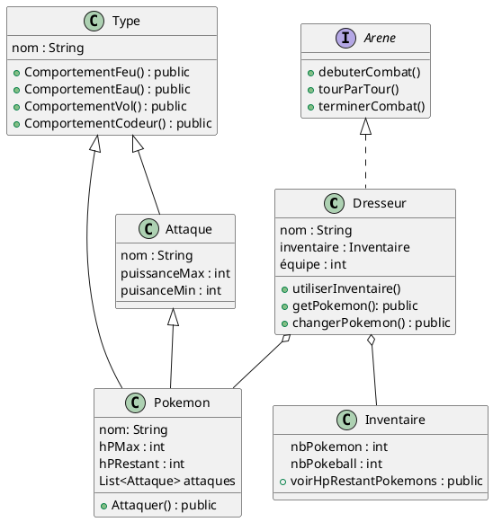

# Application Pokemon en Java

Jeu de combat de Pokemon version deeeev, 2 dresseurs s'affrontent dans une arène jusqu'à que mort s'en suive !

## Prérequis

- **Java 21.0**

## Diagramme de classes

## Usage
L'application est en cours de construction. :poop: :construction:

## Contributions :busts_in_silhouette:

- Amine :busts_in_silhouette:
- Justine :busts_in_silhouette:
- Gaëtan :busts_in_silhouette:
