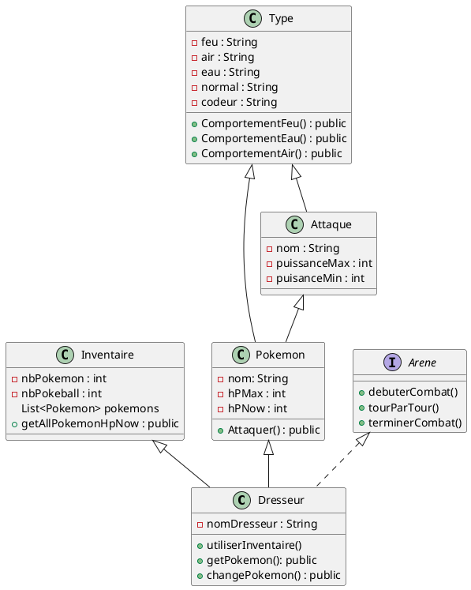

# Application Pokemon en Java

Jeu de combat de Pokemon, 2 dresseurs s'affrontent dans une arène jusqu'à que mort s'en suive !

## Prérequis

- **Java 21.0**

## Diagramme de classes

## Usage

```plantuml
@startuml

Class Dresseur extends Inventaire, Pokemon implements Arene{
- nomDresseur : String
+ utiliserInventaire()
+ getPokemon(): public
+ changePokemon() : public
}

Class Pokemon extends Type, Attaque {
- nom: String
- hPMax : int
- hPNow : int
+ Attaquer() : public
}

Class Type {
- feu : String
- air : String
- eau : String
- normal : String
- codeur : String
+ ComportementFeu() : public
+ ComportementEau() : public
+ ComportementAir() : public
}

Class Attaque extends Type {
- nom : String
- puissanceMax : int
- puisanceMin : int

}

Interface Arene{
+ debuterCombat()
+ tourParTour()
+ terminerCombat() 
}


Class Inventaire {
- nbPokemon : int
- nbPokeball : int
List<Pokemon> pokemons
+ getAllPokemonHpNow : public
}


@enduml
```